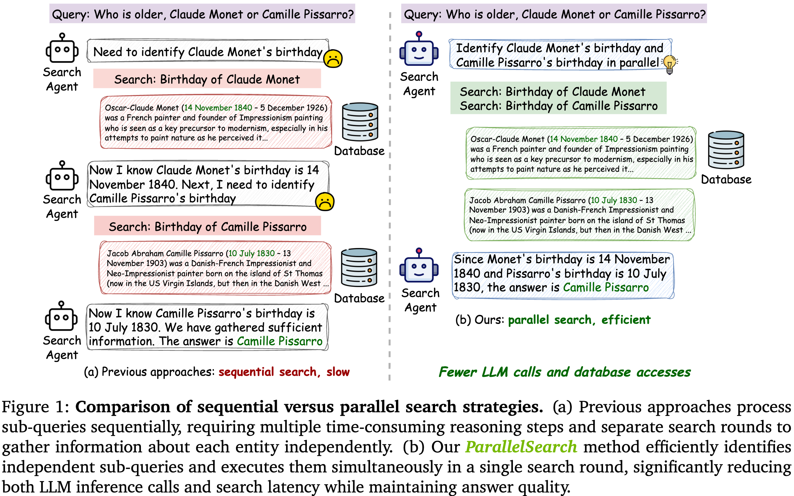
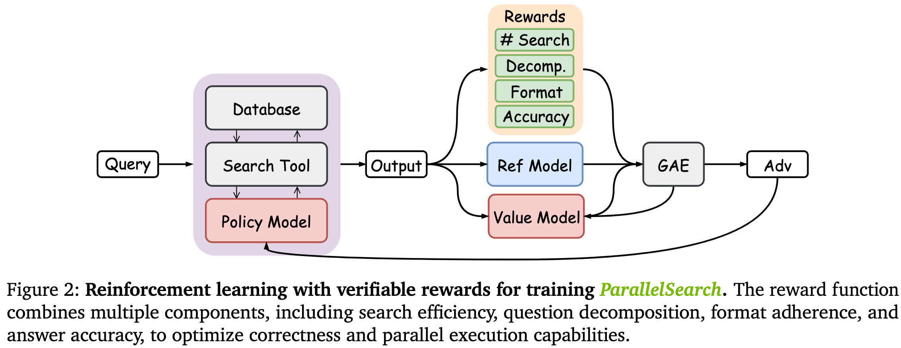

# ParallelSearch: Train your LLMs to Decompose Query and Search Sub-queries in Parallel with Reinforcement Learning

[](https://www.python.org/downloads/release/python-3100/)
[](https://opensource.org/licenses/Apache-2.0)
[](https://shuzhao.me/ParallelSearchProject/)
[](https://arxiv.org/abs/2508.09303)

## 📌 Overview

**ParallelSearch** revolutionizes how Large Language Models interact with search engines by enabling **parallel query execution** instead of sequential processing. Our reinforcement learning framework teaches LLMs to intelligently decompose complex questions into independent sub-queries that can be executed simultaneously, dramatically improving both efficiency and effectiveness.

### 🎯 Key Innovation
<div align="center">

</div>

Traditional search agents process queries sequentially, creating significant bottlenecks. ParallelSearch identifies when queries can be parallelized and executes them concurrently, reducing inference time and API calls while maintaining or improving answer quality.

## 🏗️ Architecture

<div align="center">

</div>

ParallelSearch uses a novel reward structure combining:
- **Outcome reward**: Answer correctness
- **Decomposition reward**: Proper query parallelization
- **Search count reward**: Efficiency optimization
- **Format reward**: Adherence to reasoning format

## 🌟 Features

- **Parallel Search Architecture**: Train LLMs to perform multiple search operations concurrently
- **Reinforcement Learning Training**: Use PPO for stable model training
- **Scalable Implementation**: Built on vLLM and Ray for distributed training and inference
- **Comprehensive Evaluation**: Built-in evaluation scripts and metrics

## 📋 Prerequisites

- **System Requirements**: Linux (tested on Ubuntu 22.04)
- **Hardware**: 8 NVIDIA H100 GPUs with CUDA 12.4 (can be adapted for smaller setups)
- **Software**: Python 3.10, torch 2.4.0, vLLM 0.6.3

## 🤗 Model Checkpoints
Access our pre-trained models on Hugging Face:
[🔗 ParallelSearch Collection](https://huggingface.co/collections/TreezzZ/parallelsearch-689543fb7d6eabe88d7879e4)

## 🚀 Installation

### Step 1: Main Environment Setup

```bash
# Create and activate conda environment
conda create -n parallelsearch python=3.10
conda activate parallelsearch

# Install PyTorch with CUDA support
pip install torch==2.4.0 --index-url https://download.pytorch.org/whl/cu121

# Install dependencies (fixes package conflicts)
cd $HOME
git clone https://github.com/Tree-Shu-Zhao/outlines.git
cd outlines 
pip install -e .

# Install VLLM and core packages
pip install vllm==0.6.3

# Clone and install ParallelSearch
cd $HOME
git clone https://github.com/Tree-Shu-Zhao/ParallelSearch.git
cd ParallelSearch
pip install -e .

# Install additional dependencies
pip install flash-attn --no-build-isolation
pip install wandb

# Setup Weights & Biases
wandb login
```

### Step 2: Retriever Environment (Optional)

For local retrieval engines, create a separate environment:

```bash
# Create retriever environment
conda create -n retriever python=3.10
conda activate retriever

# Install PyTorch with conda for better FAISS compatibility
conda install pytorch==2.4.0 torchvision==0.19.0 torchaudio==2.4.0 pytorch-cuda=12.1 -c pytorch -c nvidia

# Install retrieval dependencies
pip install transformers datasets pyserini

# Install FAISS-GPU for efficient retrieval
conda install -c pytorch -c nvidia faiss-gpu=1.8.0

# Install API server dependencies
pip install uvicorn fastapi
```

## 🏃‍♂️ Quick Start
1. Download Data and Indices
```bash
# Set your data path
export SAVE_PATH=/path/to/your/data

# Download Wikipedia corpus and E5 index
python scripts/download.py --save_path $SAVE_PATH
cat $SAVE_PATH/part_* > $SAVE_PATH/e5_Flat.index
gzip -d $SAVE_PATH/wiki-18.jsonl.gz

# Download MultihopRAG corpus and E5 index (optional)
huggingface-cli download --repo-type dataset TreezzZ/multihoprag-index
```

2. Prepare Training Data
```bash
# Process NQ and HotpotQA datasets as the train set; process 7 benchmarks as the test set
bash scripts/nq_hotpotqa/data_process.sh

# Generate parallel and sequential test data
python scripts/data_process/qa_search_test_parallel_sequential.py
```

3. Start Retrieval Server
```bash
conda activate retriever
bash retrieval_launch.sh
```

4. Begin Training
```bash
conda activate parallelsearch
bash train_parallelsearch.sh
```

## 📈 Evaluation
```bash
# Start retrieval server (if not already running)
conda activate retriever
bash retrieval_launch.sh

# Run evaluation on 7 benchmarks
conda activate parallelsearch
bash evaluate.sh

# Run evaluation on parallel and sequential subsets (update parameters in script as needed)
bash eval_parallelsearch.sh
```

## 📄 License
This project is licensed under the Apache License 2.0 - see the LICENSE file for details.

## 🏆 Citation
If you found our paper useful, please cite it:

```bibtex
@article{zhao2025parallelsearch,
  title={ParallelSearch: Train your LLMs to Decompose Query and Search Sub-queries in Parallel with Reinforcement Learning},
  author={Zhao, Shu and Yu, Tan and Xu, Anbang and Singh, Japinder and Shukla, Aaditya and Akkiraju, Rama},
  journal={arXiv preprint arXiv:2508.09303},
  year={2025}
}
```

## 🙏 Acknowledgments
This project builds upon:

- [Search-R1](https://github.com/PeterGriffinJin/Search-R1)
- [vLLM](https://docs.vllm.ai/en/latest/)

Special thanks to [NVIDIA Brev Team](https://developer.nvidia.com/brev) for their hardware and training resources support.

___

⭐ Star this repo if you find it useful!
